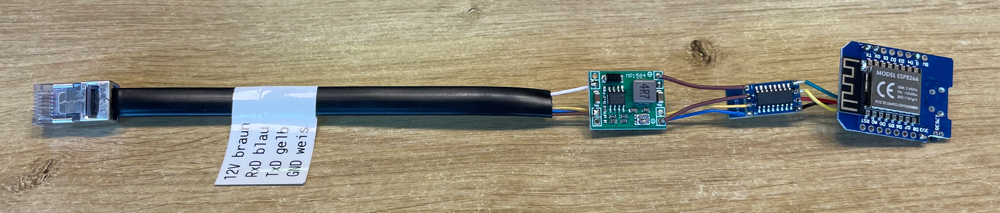
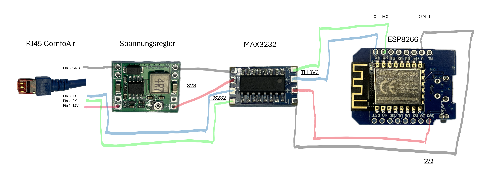

# ComfoAir-MQTT-ESPController

## Über das Projekt
Dieses Projekt ermöglicht die Steuerung einer ComfoAir Lüftungsanlage über MQTT mit einem ESP8266 Mikrocontroller. Es ist ideal für Heimautomatisierungsenthusiasten, die ihre Lüftungsanlage in ein Smart-Home-System integrieren möchten.

## Technische Details
- **Mikrocontroller**: ESP8266
- **Schnittstellenkonverter**: MAX3232
- **Spannungswandler**: 12V auf 3,3V
- **Kommunikation**: RJ45 Kabel
- **Entwicklungsumgebung**: Arduino IDE

## Installation und Setup
### Voraussetzungen
- Ein ESP8266 Mikrocontroller
- Ein USB-Kabel, um den ESP8266 mit Ihrem Computer zu verbinden
- Die neueste Version der Arduino IDE (herunterladbar von [Arduino Website](https://www.arduino.cc/en/software))

### Schritt 1: Arduino IDE einrichten
1. **Installieren Sie die Arduino IDE**: Laden Sie die Software von der offiziellen Website herunter und installieren Sie sie auf Ihrem Computer.

2. **ESP8266 Board-Manager hinzufügen**:
   - Starten Sie die Arduino IDE.
   - Gehen Sie zu `Datei` > `Voreinstellungen`.
   - Fügen Sie in das Feld "Zusätzliche Boardverwalter-URLs" folgende URL ein: `http://arduino.esp8266.com/stable/package_esp8266com_index.json`.
   - Klicken Sie auf "OK".

3. **ESP8266 Boards installieren**:
   - Gehen Sie zu `Werkzeuge` > `Board` > `Boards Manager...`.
   - Suchen Sie nach "ESP8266" und installieren Sie das Paket.

### Schritt 2: PubSubClient Bibliothek installieren
1. In der Arduino IDE, gehen Sie zu `Sketch` > `Bibliothek einbinden` > `Bibliotheken verwalten...`.
2. Geben Sie in das Suchfeld "PubSubClient" ein und installieren Sie die Bibliothek.

### Schritt 3: ESP8266 mit der Arduino IDE konfigurieren
1. Schließen Sie den ESP8266 über das USB-Kabel an Ihren Computer an.
2. Wählen Sie in der Arduino IDE unter `Werkzeuge` > `Board` Ihr ESP8266-Board aus (z.B. "Generic ESP8266 Module").
3. Wählen Sie den richtigen COM-Port unter `Werkzeuge` > `Port`.

### Schritt 4: Code schreiben und hochladen
1. **Code schreiben**: Schreiben Sie Ihren Code oder öffnen Sie Ihr Projekt in der Arduino IDE.
2. **Konfigurieren Sie WLAN und MQTT-Einstellungen**: Stellen Sie sicher, dass Sie die SSID und das Passwort Ihres WLANs sowie die MQTT-Serverdetails in Ihrem Code korrekt eingetragen haben.
3. **Code hochladen**:
   - Klicken Sie auf den Pfeil-Button in der oberen linken Ecke der Arduino IDE, um den Code zu kompilieren und auf den ESP8266 hochzuladen.
   - Warten Sie, bis der Upload-Prozess abgeschlossen ist. In der Konsole unten in der IDE wird eine Erfolgsmeldung angezeigt.

### Schritt 5: Testen
- Nachdem der Code erfolgreich hochgeladen wurde, können Sie den ESP8266 testen, indem Sie ihn in Ihrem Netzwerk betreiben und überprüfen, ob er die erwarteten MQTT-Nachrichten sendet und empfängt.

### Hinweise
- Stellen Sie sicher, dass Sie während des Hochladens des Codes keine anderen Geräte (wie Sensoren oder Aktoren) an den ESP8266 angeschlossen haben, da dies manchmal zu Problemen beim Hochladen führen kann.
- Wenn Sie Probleme beim Hochladen haben, versuchen Sie, den Boot-Modus des ESP8266 zu ändern, indem Sie bestimmte Pins (z.B. GPIO0) auf GND ziehen, abhängig von Ihrem spezifischen Board.

## Code-Übersicht
Der Code (`KWL_C_v3.ino`) beinhaltet die Logik für die MQTT-Kommunikation und die Steuerung der ComfoAir-Anlage. Hauptfunktionen umfassen:
- OTA-Firmware-Updates
- WLAN-Verbindung
- MQTT-Client-Konfiguration
- Senden und Empfangen von Befehlen an die ComfoAir-Anlage

## MQTT-Datenpunkte

### MQTT Subscribe Topics
- `ComfoAir/cmd/stufe`: Setzt die Lüftungsstufe (0-3).
- `ComfoAir/cmd/soll`: Setzt die Solltemperatur (12.0 - 28.0 °C).
- `ComfoAir/cmd/filterreset`: Setzt den Filterzähler zurück.
- `ComfoAir/cmd/errorreset`: Setzt den Fehlerzähler zurück.
- `ComfoAir/cmd/firmwareinfo`: Fordert Firmware-Informationen an.
- `ComfoAir/cmd/stufensetup/ABL_0`: Setzt individuelle Einstellungen für jede Lüftungsstufe.
- `ComfoAir/cmd/stufensetup/ABL_1`
- `ComfoAir/cmd/stufensetup/ABL_2`
- `ComfoAir/cmd/stufensetup/ZUL_0`
- `ComfoAir/cmd/stufensetup/ZUL_1`
- `ComfoAir/cmd/stufensetup/ZUL_2`
- `ComfoAir/cmd/stufensetup/ABL_3`
- `ComfoAir/cmd/stufensetup/ZUL_3`
- `ComfoAir/cmd/sendezyklus`: Setzt das Intervall für den automatischen Sendevorgang (in Sekunden).
- `ComfoAir/cmd/stosslueftung`: Aktiviert oder deaktiviert die Stoßlüftung.
- `ComfoAir/cmd/nachlaufzeit`: Setzt die Nachlaufzeit für die Stoßlüftung (in Sekunden).

### MQTT Publish Topics

#### Temperatur-Status
- `ComfoAir/status/temperatur/Soll`: Aktuelle Solltemperatur.
- `ComfoAir/status/temperatur/Aussenluft`: Temperatur der Außenluft.
- `ComfoAir/status/temperatur/Zuluft`: Temperatur der Zuluft.
- `ComfoAir/status/temperatur/Abluft`: Temperatur der Abluft.
- `ComfoAir/status/temperatur/Fortluft`: Temperatur der Fortluft.
- `ComfoAir/status/temperatur/Erdwärme`: Temperatur der Erdwärme.

#### Vorheizregister-Status
- `ComfoAir/status/vorheizregister/Frostklappe`: Status der Frostklappe.
- `ComfoAir/status/vorheizregister/Frostschutz`: Status des Frostschutzes.
- `ComfoAir/status/vorheizregister/Vorheizung`: Status der Vorheizung.
- `ComfoAir/status/vorheizregister/FrostMinuten`: Betriebsminuten im Frostschutzmodus.
- `ComfoAir/status/vorheizregister/Frostsicherheit`: Status der Frostsicherheit.

#### Motoren-Status
- `ComfoAir/status/motor/Zuluft`: Status des Zuluftmotors.
- `ComfoAir/status/motor/Abluft`: Status des Abluftmotors.
- `ComfoAir/status/motor/Zuluft_RPM`: Drehzahl des Zuluftmotors.
- `ComfoAir/status/motor/Abluft_RPM`: Drehzahl des Abluftmotors.

#### Ventilationsstufen-Status
- `ComfoAir/status/stufe/ABL_0`: Einstellungen für jede Ventilationsstufe.
- `ComfoAir/status/stufe/ABL_1`
- `ComfoAir/status/stufe/ABL_2`
- `ComfoAir/status/stufe/ZUL_0`
- `ComfoAir/status/stufe/ZUL_1`
- `ComfoAir/status/stufe/ZUL_2`
- `ComfoAir/status/stufe/ABL_3`
- `ComfoAir/status/stufe/ZUL_3`
- `ComfoAir/status/stufe/ABL_IST`: Aktuelle Ist-Werte der Ventilationsstufen.
- `ComfoAir/status/stufe/ZUL_IST`
- `ComfoAir/status/stufe/STUFE`: Aktuelle Lüftungsstufe.
- `ComfoAir/status/stufe/vent_abl`: Status des Abluftventilators.

#### Bypass-Status
- `ComfoAir/status/Bypass`: Status des Bypass-Ventils.

#### Betriebsstunden-Status
- `ComfoAir/status/betriebs_h/Stufe_0`: Betriebsstunden für verschiedene Modi und Stufen.
- `ComfoAir/status/betriebs_h/Stufe_1`
- `ComfoAir/status/betriebs_h/Stufe_2`
- `ComfoAir/status/betriebs_h/Frost`
- `ComfoAir/status/betriebs_h/Vorheizung`
- `ComfoAir/status/betriebs_h/Bypass`
- `ComfoAir/status/betriebs_h/Filter`
- `ComfoAir/status/betriebs_h/Stufe_3`

#### Störungs-Status
- `ComfoAir/status/error/FehlerCode`: Aktueller Fehlercode.
- `ComfoAir/status/error/Filter`: Status des Filters.
- `ComfoAir/status/error/Text`: Beschreibung des aktuellen Fehlers.

#### Firmware-Informationen
- `ComfoAir/status/Firmware_Version`: Firmware-Version des Geräts.
- `ComfoAir/status/Geraete_Name`: Name des Geräts.

#### Sendezyklus-Status
- `ComfoAir/status/sendezyklus`: Dauer des aktuellen Sendezyklus in Sekunden.

## Verwendung
Erläutern Sie, wie das System über MQTT-Befehle gesteuert wird.

## Dokumentation und Ressourcen
- [Protokollbeschreibung ComfoAir](http://www.see-solutions.de/sonstiges/Protokollbeschreibung_ComfoAir.pdf)
- [Bedienungsanleitung ComfoAir](https://www.oeko-therm-systems.at/media/docs/bedienungsanleitungen/zehnder-bedienungsanleitung-ca350.pdf)

## Sicherheitshinweise
Stellen Sie sicher, dass Sie Ihre WLAN- und MQTT-Zugangsdaten nicht öffentlich machen.

## Beitragen und Support
Informationen dazu, wie man zum Projekt beitragen kann und wo man Unterstützung findet.

## Entwicklungsboard

